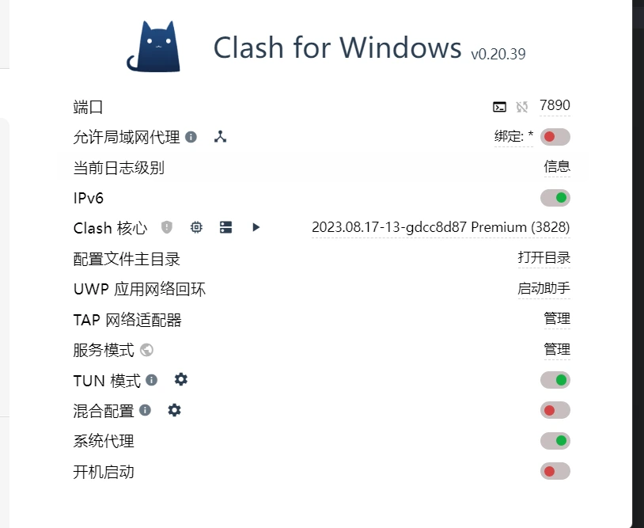
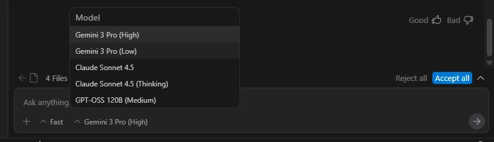

# 引言
前几天谷歌推出了Gemini 3.0，试了下效果不错，感觉输出速度比之前快很多

听说现在对视频内容的理解非常好，之后打算试试看

# Antigravity 无法登录怎么解决

这里以clash举例，只要将`TUN模式`打开就可以登录了，如果还是不行，那可能是节点的问题

我这里用美国，巴西，新加坡都可以正常使用

# 使用体验

使用体验还行，就是偶尔会有断连

但免费无需多言好吧

还有免费的claude 4.5，不过感觉Gemini的体验好一点，虽然claude 4.5输出结果更快

但大多数时候都是Gemini解决了问题，而且Gemini的限额反而少一点

我用了一下午，3-4个小时后遇到了限额，提醒我一个小时后就可以继续使用，claude 4.5好像是2个小时

不知道还能白嫖多久，就这样

**[官方链接](https://antigravity.google/)**