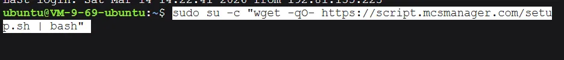
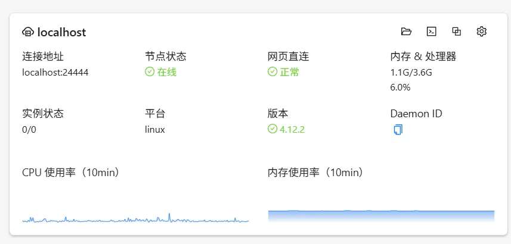
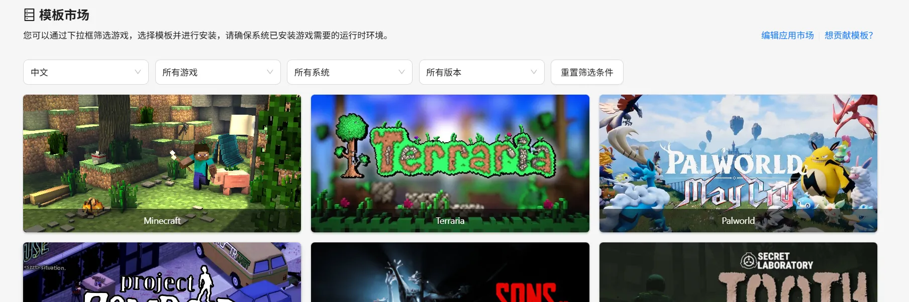
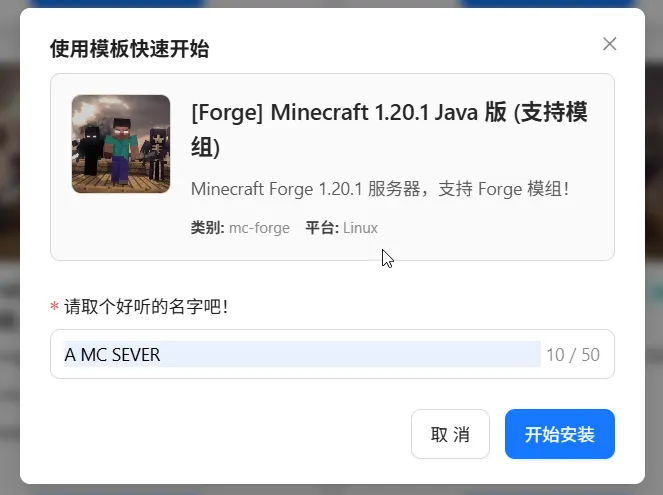
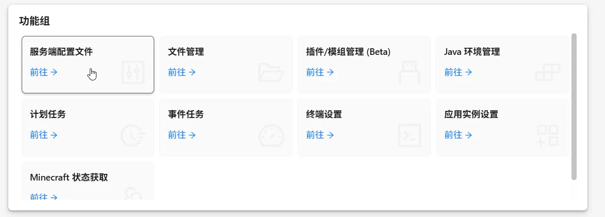
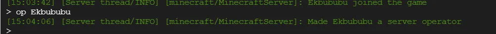
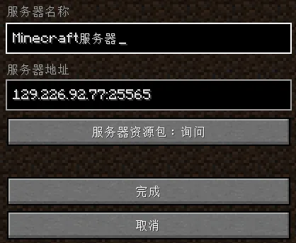

# 引言
想和朋友联机却不能一直开着电脑，或者有打算当一名服主,刚好我手上有一新加坡的vps可以用来给大家出一个教程


# 服务器怎么来

服务器可以从各大厂商处购买，正常原版2-3人游玩买一个2核4g的就可以了，一个月大概20块

如果打算玩大型整合包就需要上4核8g或者4核16g了，50-150多，看具体配置

我手上这台是2核心4g的，所以就用原版举例，后面要是有需求，可以出一期带模组的


# 首先连接上服务器

如何连接服务器呢，首先你需要下载软件finalshell，其他工具当然也是可以

由于我是在[zeabur](/tools/zeabur/)上购买的服务器，他网页上提供一个ssh页面,所以这里我就不安装了

# 安装 MCSManager

根据上面挑选好服务器和安装好工具后就可以去安装`MCSManager`了

::github{repo="MCSManager/MCSManager"}

这是一个开源的服务器面板，方便安装和查看服务器状态


**一行命令快速安装**
```bash
sudo su -c "wget -qO- https://script.mcsmanager.com/setup.sh | bash"
```

```bash
sudo systemctl start mcsm-{web,daemon} # 开启面板
sudo systemctl stop mcsm-{web,daemon} # 关闭面板
```


# 安装java

这里安装的是java17 你也可以选择其他版本 `出现y/n按y加回车确认`
```bash
sudo apt update
sudo apt install openjdk-17-jre-headless
```
等结束使用java -version确认安装情况，有返回就是安装成功了
```bash
java -version
```

然后选择你的网页进入你的ip:23333

选择中文然后创建管理员账号，点击导航进入节点，网页直连正常就是可以了



# 安装游戏版本

MCSManager给我们提供了几个模板可以使用，模板市场选择我的世界


找到Linux版的模板选择安装



当然也可以选择导入压缩包安装，这里就先使用模板安装

期间启动可能会出错，只要不停止就行，如果失败点击重启或者更新试试看

当出现 `Preparing spawn area: 0%` 就是正在创建地图

等到0%加载完毕就可以，启动游戏进入世界了

# 进入游戏

你可以在服务器配置文件中对服务器进行修改



也可以在终端下面使用`mc指令`如修改时间，和赋予op权限等



如果你有域名可以给服务器使用，这样就不会暴露服务器ip

进入游戏后你就可以将ip分享给你的朋友一起游玩，即使你不在线也不会影响到他们



希望这篇文章能够帮助到你