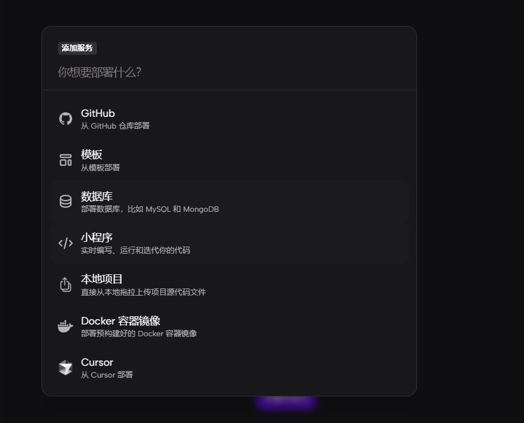
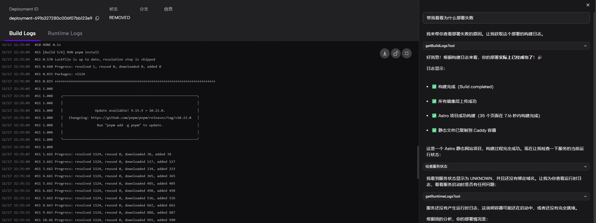

# 核心功能

## 一键部署

有多种部署方式

其中模板已经有一定的规模，说不定可以找到想要的服务

快速部署 MySQL、Redis 等数据库和各类服务

# AI 运维支持

AI智能化的应用管理和监控

## 最新更新
Zeabur AI Hub统一接入多种主流 AI 模型

GitHub 集成实现自动部署

支持开发、测试、生产环境的独立部署

# 价格

按量计费灵活的成本控制，适合个人开发者和初创项目

每月送5美元的额度

# 使用场景

全栈应用的快速部署和上线，微服务架构的容器化部署，数据库和服务的一键配置

**[我的邀请](https://zeabur.com/referral?referralCode=ekti123456&utm_source=ekti123456&utm_campaign=oss)**

